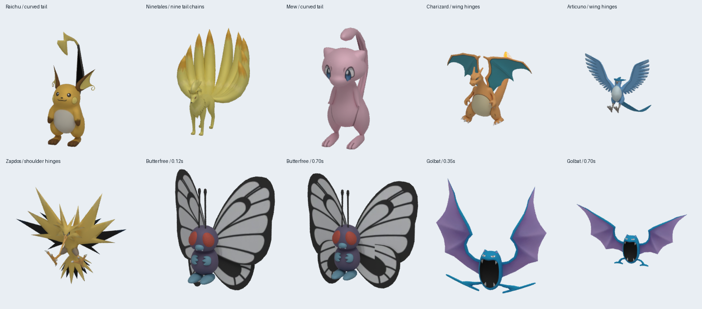

# Tail and wing idle review

The previous fallback animated only tail segments 1–3 and treated wing bones as ordinary arms. Many wings are actually named `Feeler`, and Zapdos uses shoulder bones. Golbat's bundled GLB has no skeleton.

## Reference and implementation

Compared the existing GLB/artwork contact sheets with the official Pokédex silhouettes: [Charizard](https://www.pokemon.com/uk/pokedex/charizard), [Butterfree](https://www.pokemon.com/us/pokedex/butterfree), [Ninetales](https://www.pokemon.com/us/pokedex/ninetales), [Golbat](https://www.pokemon.com/us/pokedex/golbat), and [Mew](https://www.pokemon.com/uk/pokedex/mew). These are pose references, not animation captures; the new procedural cycles are approximations.

- Animate complete tail chains, including numbered prefixes, exporter suffixes, and multiple fox tails. Give Raichu, Ninetales, Meowth, and Mew curved resting tails. Preserve already bent segments and exclude flame branches from independent tail animation.
- Map wing hinges per species instead of rotating arms indiscriminately. Butterfree, Beedrill, Venomoth, and Scyther use membrane-wing motion; birds and dragons use slower mirrored flaps. Zubat uses its embedded `Take 001` clip. Existing authored idle clips retain priority.
- Add a five-bone runtime skin to Golbat: a fixed body plus shoulder and tip joints per wing, with blended weights. The small mouth mesh remains unchanged. Clone and dispose the generated geometry and skeleton per instance.

## Verification



Offline Blender renders use poses exported from the actual runtime animator. Reviewed Charizard, Butterfree, Pidgeot, Raichu, Ninetales, Golbat, Venomoth, Articuno, Zapdos, and Mew; the contact sheet includes two phases for Butterfree and Golbat. The browser was not used for this review. This is a representative appendage review, not a visual certification of all 151 species or all cycle frames.

Tests exercise all 151 actual models through animation transitions, verify distal tail and wing movement, and check Golbat's weights, unchanged bind-pose geometry, fixed torso, moving wings, and unchanged cached source. Build, lint, and 344 tests pass.

To reproduce a pose render (optional Blender Python environment required):

```sh
node scripts/export-pokemon-idle.mjs /tmp/pokemon-idle 0.35 6 12 26 38 42 144 151
POKEMON_MODEL_DIR=/tmp/pokemon-idle python scripts/render-pokemon-model.py 42
```

The exporter skips texture decoding, retains the GLB's original textures, and excludes root bobbing so silhouette comparisons remain centered. Generated Golbat skin deformation is baked into the review copy only; the app uses its live skeleton.
